# AniLines - Anime Lineart Extractor


*©Oniichan wa Oshimai!*

⭐ **AniLines** is a simple tool to extract lineart from anime images and videos.

[🤗HuggingFace Demo](https://huggingface.co/spaces/aidenpan/AniLines-Anime-Lineart-Extractor)

## Contents
- [Features](#features)
- [How to use](#how-to-use)
  - [Environment](#environment)
  - [Run Inference](#run-inference)
  - [Inference acceleration](#inference-acceleration)
- [Gallery](#gallery)
- [Related Works](#related-works)
- [Acknowledgements](#acknowledgements)
- [Citation](#citation)
- [License](#license)


## Updates
- [x] Init Repo - 2025/02/10
- [x] Support for video - 2025/02/11
- [x] Gradio UI and 🤗Huggingface Demo - 2025/02/19 


## Features
### What does AniLines do?

Like [🚀MangaLineExtraction](https://github.com/ljsabc/MangaLineExtraction_PyTorch) and [👓Anime2Sketch](https://github.com/Mukosame/Anime2Sketch), **AniLines** generates sketch from anime(🎞️cel animation🎞️ in particular) images, it generally provides more details and clearer lines with fewer artifacts on characters. 

| Input | [MangaLine](https://github.com/ljsabc/MangaLineExtraction_PyTorch) | [Anime2Sketch](https://github.com/Mukosame/Anime2Sketch) | DoG(Binary) | AniLines(Basic) | AniLines(Detail) |
| --- | --- | --- | --- | --- | --- |
|  |  |  |  |  |  |
|  |  |  |  |  |  |
|  |  |  |  |  |  |
|  |  |  |  |  |  |
|  |  |  |  |  |  |
|  |  |  |  |  |  |
|  |  |  |  |  |  |


*©Urusei Yatsura 2022, ©Violet Evergarden, ©Miss Kobayashi's Dragon Maid, ©Little Witch Academia*

All input images shown above were inferenced at a 1080p resolution. It is also advised to use 1080p images for better performance.

### How does AniLines work?

**AniLines** has two modes: `basic` and `detail`. While `basic` model extracts the main structure of a drawing, `detail` model provides the sketch on more elements like backgrounds and cel edges. Personally speaking, `detail` mode has better performance as it has a higher 'recall' score, and consequently miss less lines.

| input | basic mode | detail mode |
| --- | --- | --- |
|  | 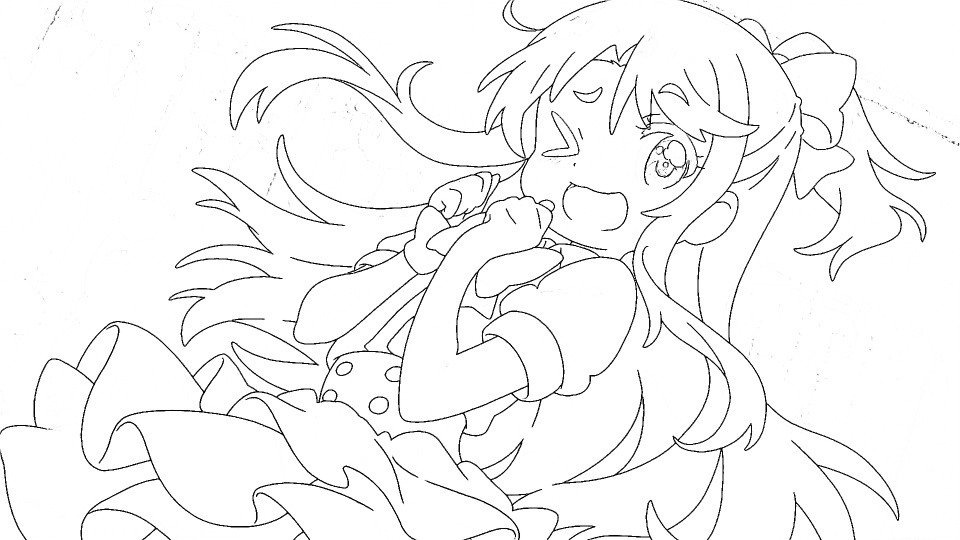 | 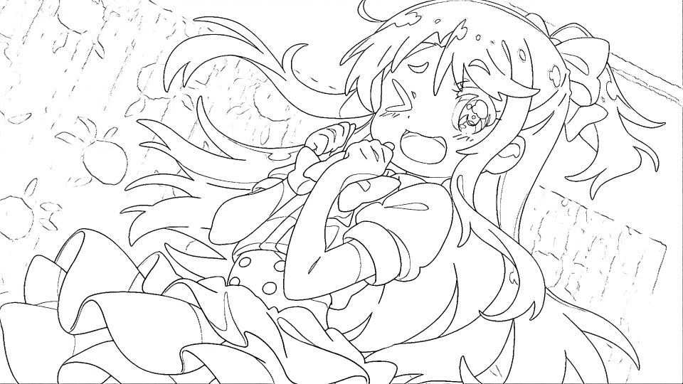 |

*©Watashi ni Tenshi ga Maiorita!*


## How to use
### Environment

First, clone this repo, create a new conda environment and install the requirements:

```bash
git clone https://github.com/zhenglinpan/AniLines-Anime-Line-Extractor.git
cd AniLines-Anime-Line-Extractor

conda create -n anilines python=3.12 -y
conda activate anilines

pip install -r requirements.txt
```

Then, download the pre-trained models from the links below and put them in the `./weights` folder
- [Basic model](https://drive.google.com/file/d/14Bp8mbQAbiR1rQrEsFp-uNdOou8hoCFr/view?usp=sharing)
- [Detail model](https://drive.google.com/file/d/12U1Mwlonoipk2Yvr12mNaFB30foy420o/view?usp=sharing)

### Run inference

There are two ways to use AniLines: 

👉 **1. Command line**

```bash
python infer.py --dir_in ./input --dir_out ./output --mode detail --binarize -1 --fp16 True --device cuda:0
```

You can either pass a single image or a folder to `dir_in`, the extracted lineart will be saved to the `output` folder by default.

👉 **2. Gradio UI**

An gradio interface for AniLines is available!


Here is a demo on [🤗HuggingFace Space](https://huggingface.co/spaces/aidenpan/AniLines-Anime-Line-Extractor). 

Compared with the demo, local UI allows you to process video and batch files, and presumably faster if you have better machines. It is much recommended to run locally with your gpu machine, you can simply run the following command to start the UI locally:

```bash
python app.py
```

### Video support
AniLines supports video processing. When a video file is provided, it will generate a video of the extracted lineart.

### Binarized output
Binarized lines are often used in animation production. AniLines provides an API for this feature. By default, binarization is disabled (set to `-1`). You can enable binarization by setting the `--binarize` parameter to any value between 0 and 1. This will adjust the threshold for binarizing the output.
| input | no binarize | binarize 0.5 | binarize 0.95 |
| --- | --- | --- | --- |
|  |  | 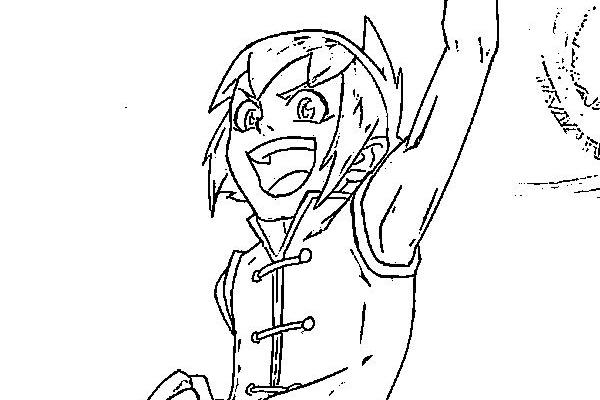 | 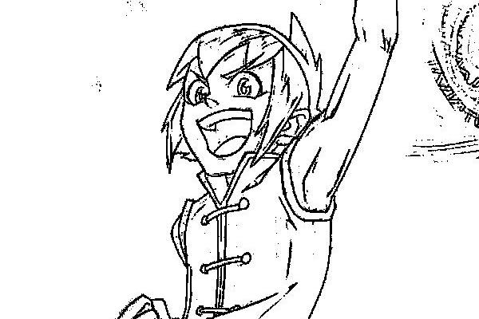 |

*©RainbowSea*

### Inference acceleration
By default, AniLines uses `fp16` to accelerate inference, trading marginal performance for a considerable speed boost. You can set `--fp16` to `False` if your GPU does not support it or if you prefer full precision. When using `fp16`, the model runs up to `5 times faster`, as tested with 1080p images.

For further accleration, you can play with **TensorRT**/**TorchTRT** with **onnx** to achieve its maximum potential speed.

## Gallery
Here are some more examples of AniLines inference results. AniLines is basically designed to work for cel animation images, but it does maintain an acceptable transferability to other types of images, like illustrations or flat color without clear edges. This gallery will be updated with more examples in the future.

| input | detail mode |
| --- | --- |
| 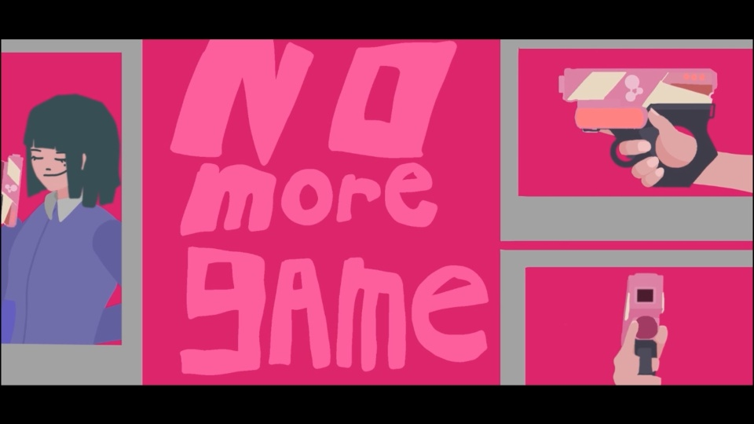 | 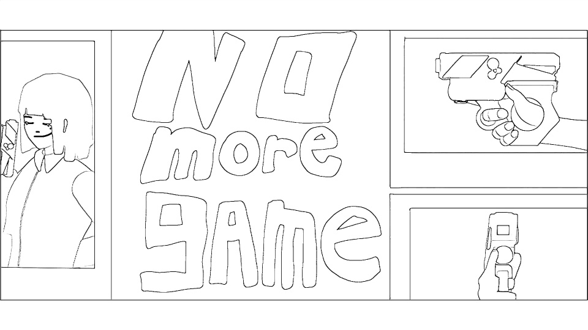 |
| 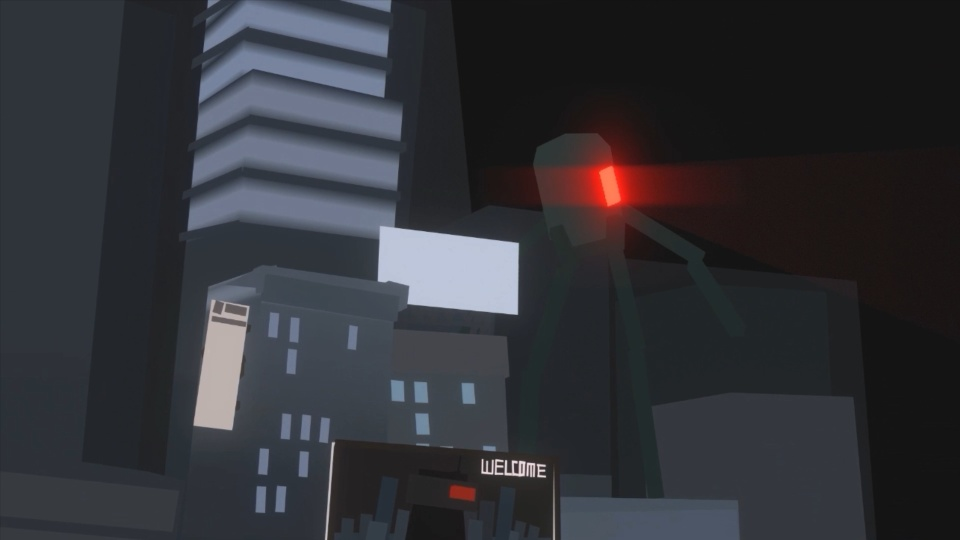 | 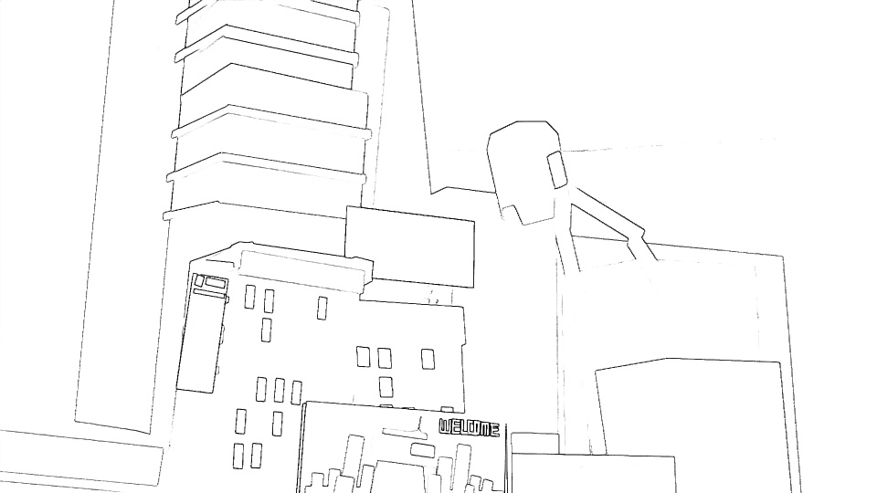 |
| 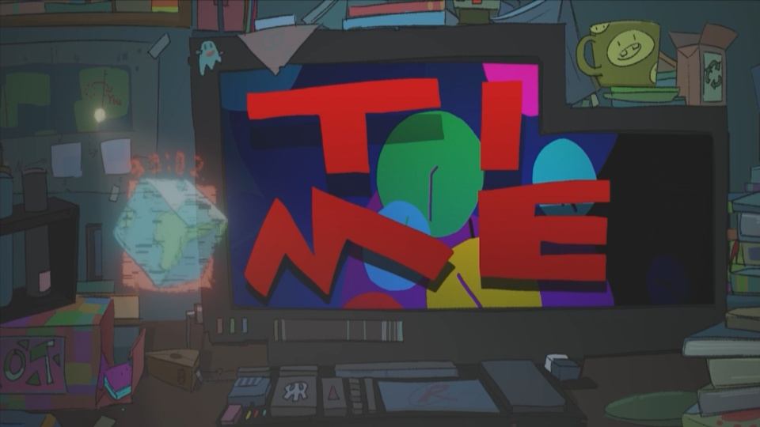 | 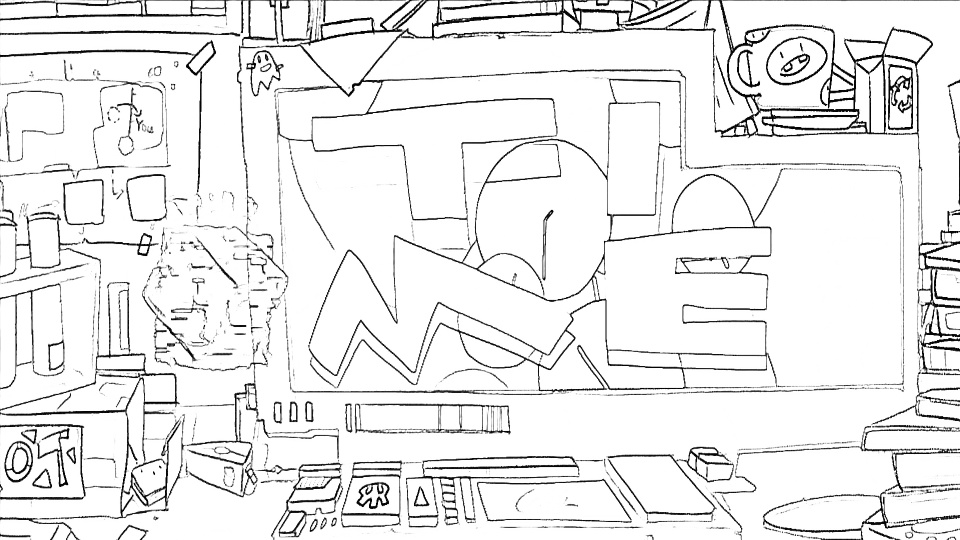 |
| 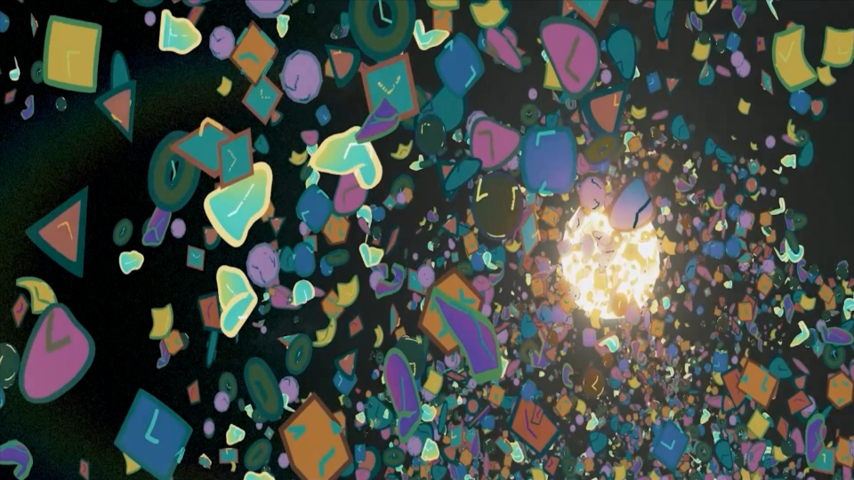 | 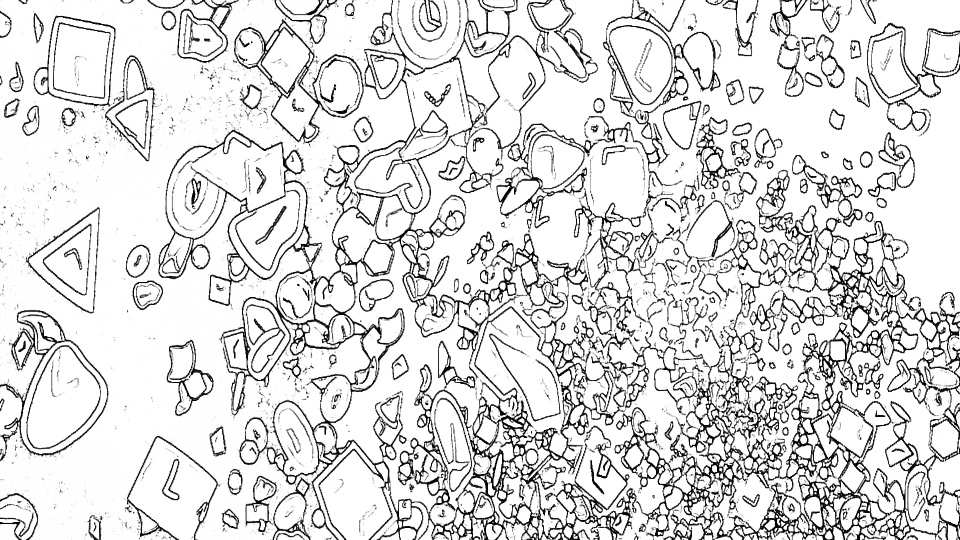 |

*©[YuZhu](https://github.com/UNKNOWNTIMER)*


## Related works
Here are some other anime lineart extraction projects that you might find interesting:
- [MangaLineExtraction](https://github.com/ljsabc/MangaLineExtraction_PyTorch)
- [Anime2Sketch](https://github.com/Mukosame/Anime2Sketch)
- [LineDistiller](https://github.com/hepesu/LineDistiller)
- [sketchKeras](https://github.com/lllyasviel/sketchKeras)
- [DoG(with fine-tuned hyperparameters)](https://github.com/ShuhongChen/eisai-anime-interpolator/blob/f0e216cce18b99d10a0e60d465565afd302f1de7/_util/sketchers_v1.py#L45)
- [sketch-extraction-of-anime-character](https://github.com/joejoe2/sketch-extraction-of-anime-character)


## Acknowledgements
Special thanks to [Shuhong](https://github.com/ShuhongChen) for his advice in this project.


## Citation
Feel free to cite this work if you find it useful for your research:

```bibtex
@misc{AniLines,
  author = {Zhenglin Pan},
  title = {AniLines - Anime Lineart Extractor},
  publisher = {GitHub},
  year = {2025},
  journal = {GitHub repository},
  howpublished = {\url{https://github.com/zhenglinpan/AniLines-Anime-Lineart-Extractor}}
}
```

## License
This project is licensed under the MIT License - see the [LICENSE](LICENSE) file for details.
